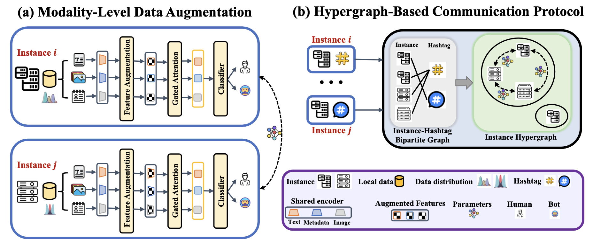
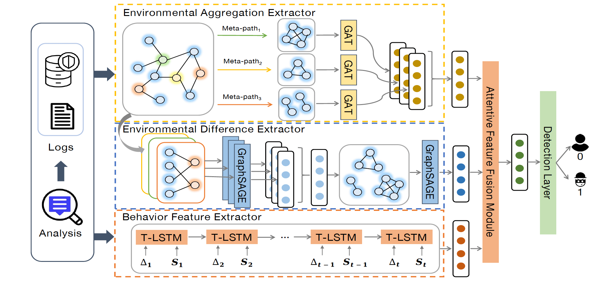
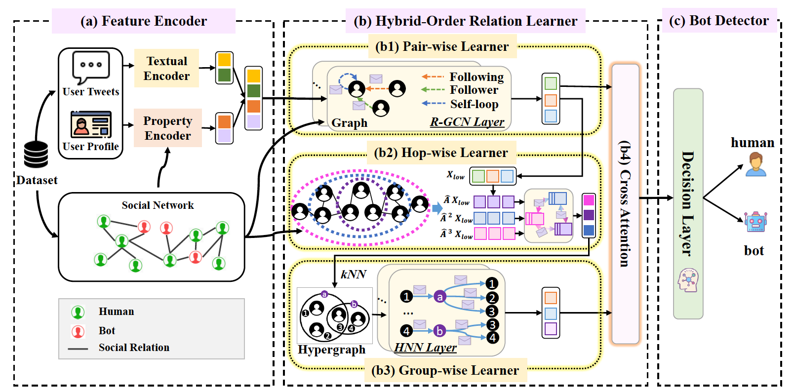
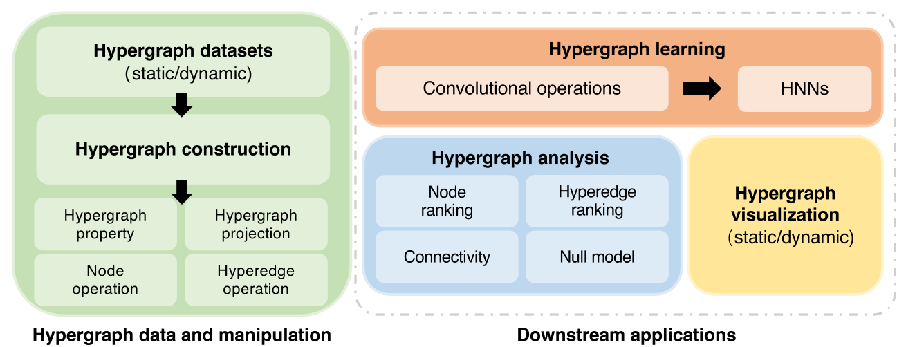
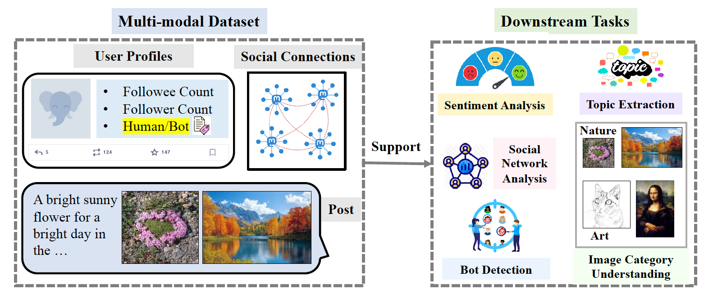
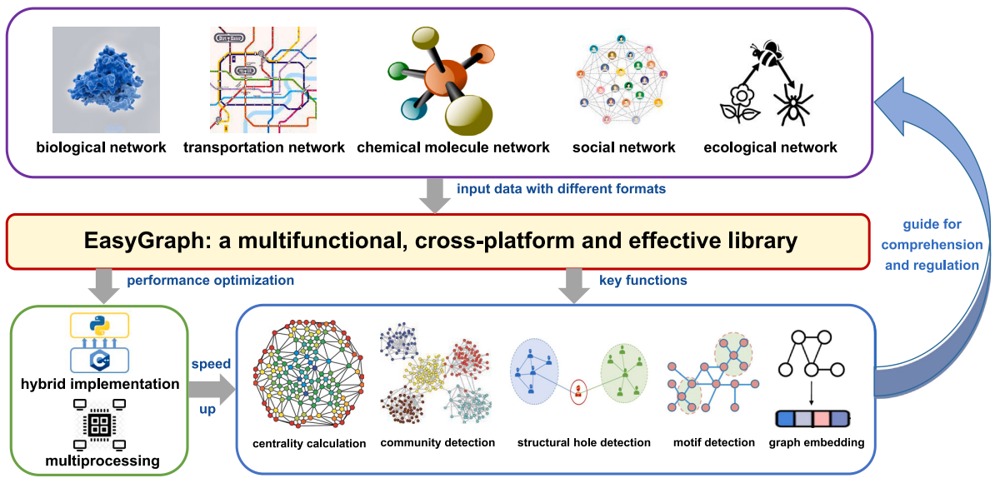

    Min Gao 高敏

Lecturer, School of Information Science and Engineering

East China University of Science and Technology

<a href="mailto:mgao9704@gmail.com">Email</a> |
<a href="https://scholar.google.com/citations?user=kVRLSrIAAAAJ&hl=zh-CN&oi=sra" target="_blank" rel="noopener noreferrer">Google Scholar</a> |
<a href="https://www.researchgate.net/profile/Min-Gao-56?ev=hdr_xprf" target="_blank" rel="noopener noreferrer">ResearchGate</a> |
<a href="https://github.com/mgao97" target="_blank" rel="noopener noreferrer">GitHub</a> |
<a href="data/Mgao_CV_ch_2605.pdf">CV</a>

Min Gao is a Lecturer at the School of Information Science and Engineering, East China University of Science and Technology. She received her Ph.D. degree from the College of Computer Science and Artificial Intelligence, Fudan University, advised by <a href="https://chenyang03.wordpress.com/" target="_blank" rel="noopener noreferrer">Prof. Yang Chen</a> and <a href="https://faculty.fudan.edu.cn/wangxin/zh_CN/" target="_blank" rel="noopener noreferrer">Prof. Xin Wang</a>. She received her M.S. degree from Fujian Normal University, advised by <a href="https://ccs.fjnu.edu.cn/15/81/c16741a333185/page.htm" target="_blank" rel="noopener noreferrer">Prof. Li Xu</a>, and her B.S. degree from Anshan Normal University.

Her research interests include graph learning, hypergraph analysis, LLMs on graphs, social bot detection, fraud detection, and social network analysis. Her recent work focuses on effective learning methods for complex graph and hypergraph data, with applications to trust, safety, and behavior modeling in online platforms.

<h2>Research Interests</h2>

LLMs on Graphs
Graph / Hypergraph Learning
Social Bot Detection
Fraud Detection
Social Network Analysis

<section class="info-card">
<h2>News</h2>
<ul class="news-list">
<li><strong>[2026/02]</strong> We released <a href="https://easy-graph.github.io/" target="_blank" rel="noopener noreferrer">EasyGraph 1.6</a>.</li>
<li><strong>[2026/01]</strong> EasyGraph reached over <strong>1 million downloads</strong> on pip.</li>
<li><strong>[2026/01]</strong> "FediScan" was accepted by <a href="https://www2026.thewebconf.org/" target="_blank" rel="noopener noreferrer">WWW 2026</a> (Oral Presentation).</li>
<li><strong>[2025/10]</strong> "Fine-Grained Behavioral Modeling..." was accepted by <a href="https://ieeexplore.ieee.org/xpl/RecentIssue.jsp?punumber=6488902" target="_blank" rel="noopener noreferrer">IEEE TNSE</a>.</li>
<li><strong>[2025/08]</strong> Two papers were accepted by <a href="https://cikm2025.org/" target="_blank" rel="noopener noreferrer">ACM CIKM 2025</a>.</li>
<li><strong>[2025/05]</strong> "EasyHypergraph" was accepted by <a href="https://www.nature.com/palcomms/" target="_blank" rel="noopener noreferrer">HSSC (Nature Portfolio)</a>.</li>
</ul>
</section>

<h2>Selected Publications</h2>

FediScan: Collaborative Social Bot Detection in the Fediverse

<strong>Min Gao</strong>, Wen Wen, Haoran Du, Qiang Duan, Yu Xiao, Yupeng Li, Xin Wang, Yang Chen

Proc. of WWW (Oral), 2026

<a href="data/FediScan_WWW26_CR.pdf">paper</a>

<a href="https://www.researchgate.net/publication/397117317_Fine-Grained_Behavioral_Modeling_with_Graph_Neural_Networks_for_Financial_Identity_Theft_Detection" target="_blank" rel="noopener noreferrer">Fine-Grained Behavioral Modeling with Graph Neural Networks for Financial Identity Theft Detection</a>

<strong>Min Gao</strong>, Qiongzan Ye, Yangbo Gao, Zhenhua Zhang, Yu Chen, Yupeng Li, Shutong Chen, Qingyuan Gong, Xin Wang, Yang Chen

IEEE TNSE, 2025

<a href="data/EnvIT_TNSE.pdf">paper</a>

<a href="https://www.researchgate.net/publication/395177643_Higher-Order_Information_Matters_A_Representation_Learning_Approach_for_Social_Bot_Detection?_tp=eyJjb250ZXh0Ijp7InBhZ2UiOiJwcm9maWxlIiwicHJldmlvdXNQYWdlIjoiaG9tZSIsInBvc2l0aW9uIjoicGFnZUNvbnRlbnQifX0" target="_blank" rel="noopener noreferrer">Higher-Order Information Matters: A Representation Learning Approach for Social Bot Detection</a>

<strong>Min Gao</strong>, Qiang Duan, Boen Liu, Yu Xiao, Xin Wang, and Yang Chen

Proc. of CIKM, 2025

<a href="data/HyperScan_CIKM_pub.pdf">paper</a>

<a href="https://www.nature.com/articles/s41599-025-05180-5" target="_blank" rel="noopener noreferrer">EasyHypergraph: an open-source software for fast and memory-saving analysis and learning of higher-order networks</a>

Bodian Ye, <strong>Min Gao</strong>, Xiu-Xiu Zhan, Xinlei He, Zi-Ke Zhang, Qingyuan Gong, Xin Wang, Yang Chen

HSSC (Nature Portfolio), 2025

<a href="data/EasyHypergraph_HSSC25.pdf">paper</a>

<a href="https://www.researchgate.net/publication/395173546_FediData_A_Comprehensive_Multi-Modal_Fediverse_Dataset_from_Mastodon?_sg%5B0%5D=I57-dS2TVXmxE7zCE_5cPvEbqVxkwUToL79gPhera4eqiz-8yHb6X5zL66pfGfbSUVyxfQUy89Y7On-AV254vqRgtddlkG9ce5gkRQCV.ntjNrwX7_dWO7rjch9cTYDtBnXmHZ_SY3TQhAWO9MTL2kWuBv80RCRvR_sVyYVVID0cPz259dZglZuEDRY_LPw&_tp=eyJjb250ZXh0Ijp7ImZpcnN0UGFnZSI6ImhvbWUiLCJwYWdlIjoicHJvZmlsZSIsInBvc2l0aW9uIjoicGFnZUNvbnRlbnQifX0" target="_blank" rel="noopener noreferrer">FediData: A Comprehensive Multi-Modal Fediverse Dataset from Mastodon</a>

<strong>Min Gao</strong>, Haoran Du, Wen Wen, Qiang Duan, Xin Wang, and Yang Chen

Proc. of CIKM (Resource Track), 2025

<a href="data/FediData_CIKM_pub.pdf">paper</a> <a href="https://github.com/FDUDataNET/FediData" target="_blank" rel="noopener noreferrer">code</a> <a href="https://zenodo.org/records/15621243" target="_blank" rel="noopener noreferrer">dataset</a>

<a href="https://www.fitee.zjujournals.com/en/article/doi/10.1631/FITEE.2300291/" target="_blank" rel="noopener noreferrer">Detecting compromised accounts caused by phone number recycling on e-commerce platforms: taking Meituan as an example</a>

<strong>Min Gao</strong>, Shutong Chen, Yangbo Gao, Zhenhua Zhang, Yu Chen, Yupeng Li, Qiongzan Ye, Xin Wang, and Yang Chen

FITEE, 2024

<a href="data/PNR_FITEE_pub.pdf">paper</a>

<a href="https://www.cell.com/patterns/pdf/S2666-3899(23)00218-0.pdf" target="_blank" rel="noopener noreferrer">EasyGraph: A Multifunctional, Cross-Platform, and Effective Library for Interdisciplinary Network Analysis</a>

<strong>Min Gao</strong>, Zheng Li, Ruichen Li, Chenhao Cui, Xinyuan Chen, Bodian Ye, Yupeng Li, Weiwei Gu, Qingyuan Gong, Xin Wang, and Yang Chen

Patterns (Cell Press), 2023

<a href="data/EasyGraph_Patterns_pub.pdf">paper</a> <a href="https://easy-graph.github.io/" target="_blank" rel="noopener noreferrer">project</a> <a href="https://github.com/easy-graph/Easy-Graph" target="_blank" rel="noopener noreferrer">code</a> <a href="https://github.com/easy-graph/easygraph_benchmark_20230501" target="_blank" rel="noopener noreferrer">datasets</a>

<section class="info-card">
<h2>Other Publications</h2>

<a class="other-pub-title" href="https://www.sciencedirect.com/science/article/pii/S0957417426012704" target="_blank" rel="noopener noreferrer">HIP: Model-agnostic hypergraph influence prediction via distance-centrality fusion and neural ODEs</a>

Susu Zhang, Jingfeng Xie, Yang Chen, <strong>Min Gao</strong>, Cong Li, Chuang Liu, Xiuxiu Zhan

<em>ESWA 2026</em> Expert Systems with Applications

<a href="https://dl.acm.org/doi/10.1145/3701716.3715298" target="_blank" rel="noopener noreferrer">FediLive: A Framework for Collecting and Preprocessing Snapshots of Decentralized Online Social Networks</a>

Shaojie Min, Shaobin Wang, Yaxiao Luo, <strong>Min Gao</strong>, Qingyuan Gong, Yu Xiao, Yang Chen

<em>WWW 2025</em> In Proceedings of the ACM on Web Conference (Resource Track)

<a href="https://link.springer.com/chapter/10.1007/978-981-96-2373-0_5" target="_blank" rel="noopener noreferrer">RoleScan: Enhancing Social Bot Detection Using Social Role Vector</a>

Wen Wen, <strong>Min Gao</strong>, Qingyuan Gong, Xin Wang, Yang Chen

<em>ChineseCSCW 2024</em>

<a href="https://dl.acm.org/doi/10.1145/3698387.3699997" target="_blank" rel="noopener noreferrer">EGGPU: Enabling Efficient Large-Scale Network Analysis with Consumer-Grade GPUs</a>

Jiawei Tang, <strong>Min Gao</strong>, Yu Xiao, Cong Li, and Yang Chen

<em>SocialMeta 2024</em>

<a href="https://ieeexplore.ieee.org/document/9892383" target="_blank" rel="noopener noreferrer">Modeling Access Environment and Behavior Sequence for Financial Identity Theft Detection</a>

Qiongzan Ye, Yangbo Gao, Zhenhua Zhang, Yu Chen, Yupeng Li, <strong>Min Gao</strong>, Shutong Chen, Xin Wang, Yang Chen

<em>IJCNN 2022</em>

<a href="https://link.springer.com/article/10.1007/s00607-022-01125-x" target="_blank" rel="noopener noreferrer">Influence maximization based on SATS scheme in social networks</a>

Xinxin Zhang, <strong>Min Gao</strong>, Li Xu, Zhaobin Zhou

<em>Computing 2022</em>

<a href="https://user.informatik.uni-goettingen.de/~ychen/papers/SCHOLAT-ChineseCSCW21.pdf" target="_blank" rel="noopener noreferrer">Understanding Scholar Networks: Taking SCHOLAT as an Example</a>

<strong>Min Gao</strong>, Yang Chen, Qingyuan Gong, Xin Wang, Pan Hui

<em>ChineseCSCW 2021</em>

<a href="https://link.springer.com/chapter/10.1007/978-981-15-9031-3_15" target="_blank" rel="noopener noreferrer">An Efficient Influence Maximization Algorithm Based on Social Relationship Priority in Mobile Social Networks</a>

Xinxin Zhang, Li Xu, and <strong>Min Gao</strong>

<em>SocialSec 2020</em>

<a href="https://onlinelibrary.wiley.com/doi/epdf/10.1002/cpe.5677" target="_blank" rel="noopener noreferrer">Influence maximization based on activity degree in mobile social networks</a>

<strong>Min Gao</strong>, Li Xu, Limei Lin, Yanze Huang, and Xinxin Zhang

<em>CCPE 2020</em> Concurrency and Computation: Practice and Experience

</section>

<section class="info-card">
<h2>Awards</h2>
<ul>
<li> <strong>Student Travel Grant</strong>, ACM SIGIR</li>
<li> <strong>Open Source Pioneer Award (Team Leader)</strong>, Fudan University</li>
<li> <strong>Open Source Security Reward Program Outstanding Student (Third Prize)</strong>, CSAC</li>
<li> <strong>Shanghai Open Source Innovation Excellence Award (Grand Prize)</strong></li>
<li> <strong>Speaker of "High-order Network"</strong>, Swarma Club</li>
<li> <strong>Annual Outstanding Translator</strong>, AI Research Center</li>
<li> <strong>Second Prize in the 9th National Mathematics Competition for College Students</strong>, Chinese Mathematical Society</li>
<li> <strong>Second Prize for C Class in the 20th National English Competition for College Students</strong>, TEFL China</li>
<li>[2015–2017] <strong>National Scholarship (highest honor in China)</strong>, Ministry of Education of China</li>
</ul>
</section>

<section class="info-card">
<h2>Teaching Experience</h2>
<ul>
<li>Teaching Assistant — Information Thinking and Practice (2021 Fall); Online Social Networks (2024 Fall); Mobile Computing (2025 Fall); Fudan University</li>
</ul>
</section>

<section class="info-card">
<h2>Professional Services</h2>
<ul>
<li><strong>Session Chair:</strong> WWW 2026; CIKM 2025; SocialMeta 2024</li>
<li><strong>PC Member:</strong> ICSC 2025; BDSC 2023</li>
<li><strong>Web Chair:</strong> SocialMeta 2022</li>
<li><strong>Invited Reviewer:</strong> ICWSM 2026; Neurocomputing 2026; TIFS 2026; TSC 2026; IPM 2026; ESWA 2026; TST 2025; TKDD 2025; TCSS 2024; JSC 2023–2026</li>
</ul>
</section>
