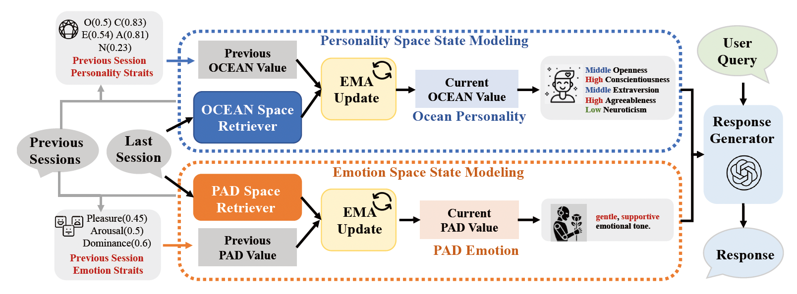
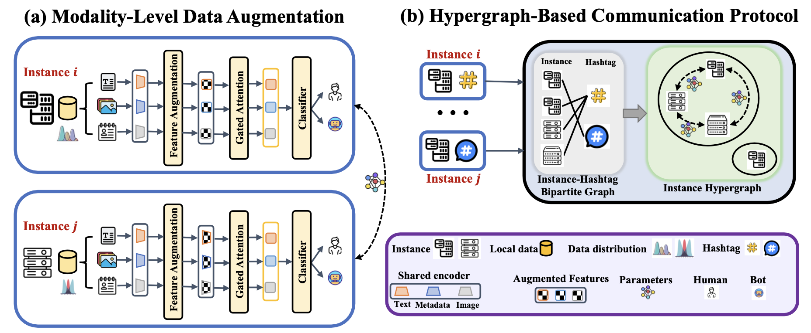
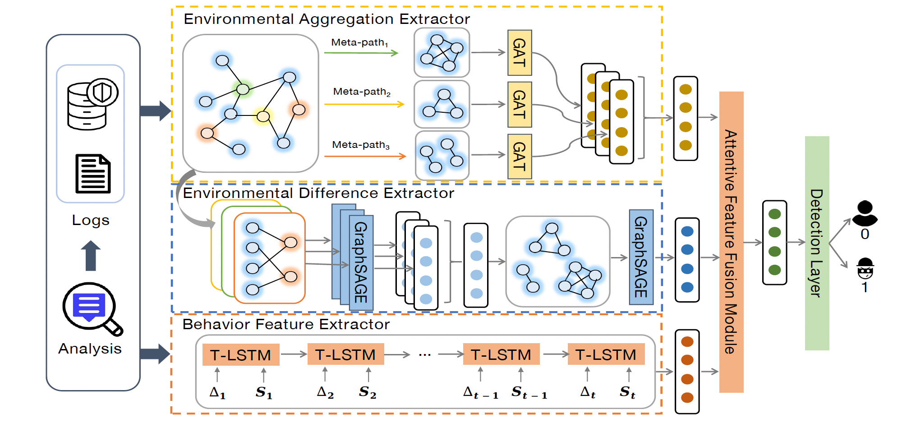
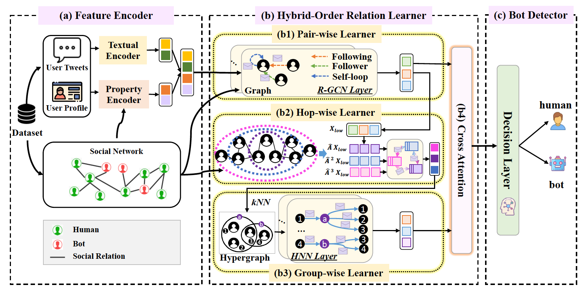
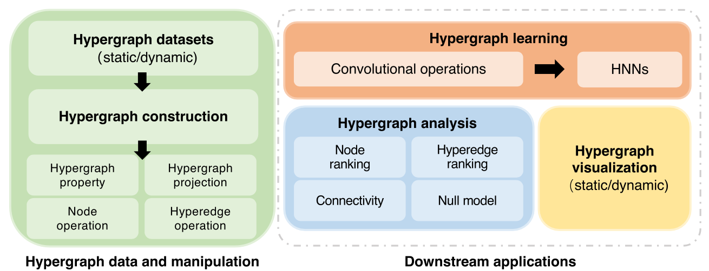
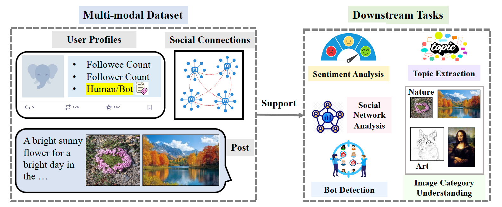
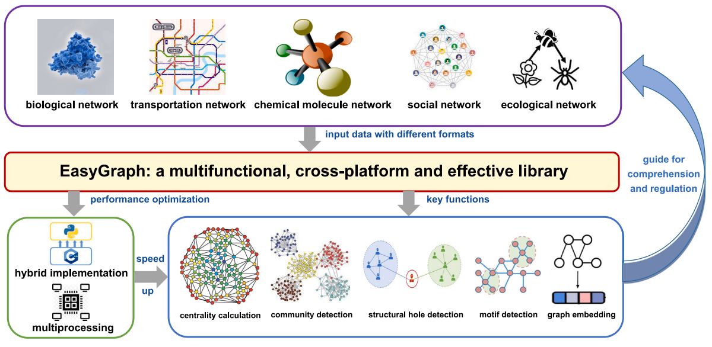

    Min Gao 高敏

    
Lecturer, School of Information Science and Engineering

    
East China University of Science and Technology

    
    <!-- 联系方式徽章 -->
    

      <a href="mailto:mgao9704@gmail.com" style="text-decoration: none; padding: 7px 15px; border-radius: 8px; background: #ffffff; color: #333; font-size: 0.9rem; font-weight: 600; display: flex; align-items: center; gap: 8px; border: 1px solid #ddd; box-shadow: 0 2px 4px rgba(0,0,0,0.05); transition: all 0.3s ease;">
        ✉ Email
      </a>
      <a href="https://scholar.google.com/citations?user=kVRLSrIAAAAJ&hl=zh-CN&oi=sra" target="_blank" rel="noopener noreferrer" style="text-decoration: none; padding: 7px 15px; border-radius: 8px; background: #e8eef9; color: #2f5aa8; font-size: 0.9rem; font-weight: 600; display: flex; align-items: center; gap: 8px; border: 1px solid #d0d9e8; box-shadow: 0 2px 4px rgba(0,0,0,0.05); transition: all 0.3s ease;">
        🎓 Google Scholar
      </a>
      <a href="https://www.researchgate.net/profile/Min-Gao-56?ev=hdr_xprf" target="_blank" rel="noopener noreferrer" style="text-decoration: none; padding: 7px 15px; border-radius: 8px; background: #e7f3ec; color: #2f6f53; font-size: 0.9rem; font-weight: 600; display: flex; align-items: center; gap: 8px; border: 1px solid #d0e8dd; box-shadow: 0 2px 4px rgba(0,0,0,0.05); transition: all 0.3s ease;">
        🔬 ResearchGate
      </a>
      <a href="https://github.com/mgao97" target="_blank" rel="noopener noreferrer" style="text-decoration: none; padding: 7px 15px; border-radius: 8px; background: #24292e; color: #ffffff; font-size: 0.9rem; font-weight: 600; display: flex; align-items: center; gap: 8px; border: 1px solid #000; box-shadow: 0 2px 4px rgba(0,0,0,0.1); transition: all 0.3s ease;">
        💻 GitHub
      </a>
      <a href="data/Mgao_CV_ch_2610.pdf" style="text-decoration: none; padding: 7px 15px; border-radius: 8px; background: #f6e8ee; color: #8a4762; font-size: 0.9rem; font-weight: 600; display: flex; align-items: center; gap: 8px; border: 1px solid #e8d0d9; box-shadow: 0 2px 4px rgba(0,0,0,0.05); transition: all 0.3s ease;">
        📄 CV
      </a>
    

    

        

            Hello! I am a Lecturer in the School of Information Science and Engineering at East China University of Science and Technology. I received my Ph.D. degree from the College of Computer Science and Artificial Intelligence, Fudan University, advised by <a href="https://chenyang03.wordpress.com/" target="_blank" rel="noopener noreferrer">Prof. Yang Chen</a> and <a href="https://faculty.fudan.edu.cn/wangxin/zh_CN/" target="_blank" rel="noopener noreferrer">Prof. Xin Wang</a>. I received my M.S. degree from Fujian Normal University, advised by <a href="https://ccs.fjnu.edu.cn/15/81/c16741a333185/page.htm" target="_blank" rel="noopener noreferrer">Prof. Li Xu</a>, and my B.S. degree from Anshan Normal University.
        

        

            My research interests include data mining, graph and hypergraph learning, and graph-based methods for large language models (LLMs). I develop learning methods for complex relational data, with a particular focus on multimodal representation learning that integrates relational, textual, and behavioral signals. My work addresses challenges in trust, safety, and behavior modeling on online platforms and emerging human–machine societies, at the intersection of network science, machine learning, and computational social science.
        

        

            Alongside method development, I build and release open-source toolkits and benchmark datasets (e.g., <a href="https://easy-graph.github.io/" target="_blank" rel="noopener noreferrer">EasyGraph</a>, our higher-order network library <a href="https://easy-graph.github.io/docs/hypergraph.html" target="_blank" rel="noopener noreferrer">EasyHypergraph</a>, <a href="https://github.com/FDUDataNET/FediLive" target="_blank" rel="noopener noreferrer">FediLive</a>, and <a href="https://github.com/FDUDataNET/FediData" target="_blank" rel="noopener noreferrer">FediData</a>) so that these evaluations stay reproducible for the community.
        

        

            💌  I am always actively looking for highly motivated students. Please email me your CV if you are interested in!
        

    

    

        
    

<!-- 研究兴趣标签：固定两行，横跨全宽 -->

  

    LLMs on Graphs
    Graph / Hypergraph Learning
    Multimodal Representation Learning
    Social Bot Detection
  

  

    Fraud Detection
    Computational Social Science
    Network Science
    AI Safety
    Human-Machine Societies
  

<section class="info-card card-news">
<h2 class="section-title sec-news"><svg viewBox="0 0 24 24" aria-hidden="true"><path fill="currentColor" d="M3 9.5v5c0 .8.7 1.5 1.5 1.5H7l6 4c.7.4 1.5-.1 1.5-.9V4.9c0-.8-.8-1.3-1.5-.9L7 8H4.5C3.7 8 3 8.7 3 9.5z"/><path fill="none" stroke="currentColor" stroke-width="1.8" stroke-linecap="round" d="M17.5 9.2a4.2 4.2 0 010 5.6M19.8 7.2a7.2 7.2 0 010 9.6"/></svg>News</h2>
<ul class="news-list">
<li><strong>[2026/06]</strong> Our paper "Beyond Retrieval: Incorporating Personality and Emotion into RAG-Based Conversational Agents" was accepted by <a href="https://icsc-conf.github.io/2026/index.html" target="_blank" rel="noopener noreferrer">ICSC 2026</a> (Best Paper Award).</li>
<li><strong>[2026/02]</strong> We released <a href="https://easy-graph.github.io/" target="_blank" rel="noopener noreferrer">EasyGraph 1.6</a>.</li>
<li><strong>[2026/01]</strong> EasyGraph reached over <strong>1 million downloads</strong> on pip.</li>
<li><strong>[2026/01]</strong> Our paper "FediScan: Collaborative Social Bot Detection in the Fediverse" was accepted by <a href="https://www2026.thewebconf.org/" target="_blank" rel="noopener noreferrer">WWW 2026</a> (Oral Presentation).</li>
<li><strong>[2025/10]</strong> Our paper "Fine-Grained Behavioral Modeling with Graph Neural Networks for Financial Identity Theft Detection" was accepted by <a href="https://ieeexplore.ieee.org/xpl/RecentIssue.jsp?punumber=6488902" target="_blank" rel="noopener noreferrer">IEEE TNSE</a>.</li>
<li><strong>[2025/08]</strong> Two papers were accepted by <a href="https://cikm2025.org/" target="_blank" rel="noopener noreferrer">ACM CIKM 2025</a>.</li>
<li><strong>[2025/05]</strong> Our paper "EasyHypergraph: an open-source software for fast and memory-saving analysis and learning of higher-order networks" was accepted by <a href="https://www.nature.com/palcomms/" target="_blank" rel="noopener noreferrer">HSSC (Nature Portfolio)</a>.</li>
<li><strong>[2025/05]</strong> Our paper "Detecting compromised accounts caused by phone number recycling on e-commerce platforms: taking Meituan as an example" was accepted by <a href="https://www.fitee.zjujournals.com/en/home/" target="_blank" rel="noopener noreferrer">FITEE</a>.</li>
<li><strong>[2025/05]</strong> Our paper "EasyGraph: A Multifunctional, Cross-Platform, and Effective Library for Interdisciplinary Network Analysis" was accepted by <a href="https://www.cell.com/patterns/home" target="_blank" rel="noopener noreferrer">Patterns (Cell Press)</a>.</li>
</ul>
</section>

<section class="info-card card-selected">
<h2 class="section-title sec-selected"><svg viewBox="0 0 24 24" aria-hidden="true"><g stroke="currentColor" stroke-width="3.2" stroke-linecap="round" fill="none"><path d="M12 3.5v17"/><path d="M4.6 7.75l14.8 8.5"/><path d="M19.4 7.75l-14.8 8.5"/></g></svg>Selected Publications</h2>

<article class="pub-card">

<svg viewBox="0 0 24 24" aria-hidden="true"><rect x="8.5" y="3" width="11.5" height="14.5" rx="2" fill="none" stroke="currentColor" stroke-width="2"/><path fill="none" stroke="currentColor" stroke-width="2" stroke-linecap="round" d="M15.5 21H6.5a2 2 0 01-2-2V7.5"/></svg>Paper
2026

<h3 class="pub-card-title"><a href="data/Psy4RAG_ICSC26.pdf">Beyond Retrieval: Incorporating Personality and Emotion into RAG-Based Conversational Agents</a></h3>

Qijian Zheng, <strong>Min Gao</strong>, Zhijun Yuan, Qin Su, Guanghui Zhou, Qiang Duan, Xiaoming Fu, Yang Chen

<em>Proc. of ICSC (Best Paper Award)</em>

Conversational AISERES 赛力斯

<a href="data/Psy4RAG_ICSC26.pdf">Paper</a>

</article>

<article class="pub-card">

<svg viewBox="0 0 24 24" aria-hidden="true"><rect x="8.5" y="3" width="11.5" height="14.5" rx="2" fill="none" stroke="currentColor" stroke-width="2"/><path fill="none" stroke="currentColor" stroke-width="2" stroke-linecap="round" d="M15.5 21H6.5a2 2 0 01-2-2V7.5"/></svg>Paper
2026

<h3 class="pub-card-title"><a href="data/FediScan_WWW26_CR.pdf">FediScan: Collaborative Social Bot Detection in the Fediverse</a></h3>

<strong>Min Gao</strong>, Wen Wen, Haoran Du, Qiang Duan, Yu Xiao, Yupeng Li, Xin Wang, Yang Chen

<em>Proc. of WWW (Oral)</em>

Social Bot DetectionMastodon

<a href="data/FediScan_WWW26_CR.pdf">Paper</a>

</article>

<article class="pub-card">

<svg viewBox="0 0 24 24" aria-hidden="true"><rect x="8.5" y="3" width="11.5" height="14.5" rx="2" fill="none" stroke="currentColor" stroke-width="2"/><path fill="none" stroke="currentColor" stroke-width="2" stroke-linecap="round" d="M15.5 21H6.5a2 2 0 01-2-2V7.5"/></svg>Paper
2025

<h3 class="pub-card-title"><a href="https://www.researchgate.net/publication/397117317_Fine-Grained_Behavioral_Modeling_with_Graph_Neural_Networks_for_Financial_Identity_Theft_Detection" target="_blank" rel="noopener noreferrer">Fine-Grained Behavioral Modeling with Graph Neural Networks for Financial Identity Theft Detection</a></h3>

<strong>Min Gao</strong>, Qiongzan Ye, Yangbo Gao, Zhenhua Zhang, Yu Chen, Yupeng Li, Shutong Chen, Qingyuan Gong, Xin Wang, Yang Chen

<em>IEEE Transactions on Network Science and Engineering (TNSE)</em>

Fraud Detection美团 Meituan

<a href="data/EnvIT_TNSE.pdf">Paper</a>

</article>

<article class="pub-card">

<svg viewBox="0 0 24 24" aria-hidden="true"><rect x="8.5" y="3" width="11.5" height="14.5" rx="2" fill="none" stroke="currentColor" stroke-width="2"/><path fill="none" stroke="currentColor" stroke-width="2" stroke-linecap="round" d="M15.5 21H6.5a2 2 0 01-2-2V7.5"/></svg>Paper
2025

<h3 class="pub-card-title"><a href="https://www.researchgate.net/publication/395177643_Higher-Order_Information_Matters_A_Representation_Learning_Approach_for_Social_Bot_Detection" target="_blank" rel="noopener noreferrer">Higher-Order Information Matters: A Representation Learning Approach for Social Bot Detection</a></h3>

<strong>Min Gao</strong>, Qiang Duan, Boen Liu, Yu Xiao, Xin Wang, and Yang Chen

<em>Proc. of CIKM</em>

Social Bot DetectionX (Twitter)

<a href="data/HyperScan_CIKM_pub.pdf">Paper</a>

</article>

<article class="pub-card">

<svg viewBox="0 0 24 24" aria-hidden="true"><rect x="8.5" y="3" width="11.5" height="14.5" rx="2" fill="none" stroke="currentColor" stroke-width="2"/><path fill="none" stroke="currentColor" stroke-width="2" stroke-linecap="round" d="M15.5 21H6.5a2 2 0 01-2-2V7.5"/></svg>Paper
2025

<h3 class="pub-card-title"><a href="https://www.nature.com/articles/s41599-025-05180-5" target="_blank" rel="noopener noreferrer">EasyHypergraph: an open-source software for fast and memory-saving analysis and learning of higher-order networks</a></h3>

Bodian Ye, <strong>Min Gao</strong>, Xiu-Xiu Zhan, Xinlei He, Zi-Ke Zhang, Qingyuan Gong, Xin Wang, Yang Chen

<em>Humanities and Social Sciences Communications (Nature Portfolio)</em>

Higher-Order Networks

<a href="data/EasyHypergraph_HSSC25.pdf">Paper</a>

</article>

<article class="pub-card">

<svg viewBox="0 0 24 24" aria-hidden="true"><rect x="8.5" y="3" width="11.5" height="14.5" rx="2" fill="none" stroke="currentColor" stroke-width="2"/><path fill="none" stroke="currentColor" stroke-width="2" stroke-linecap="round" d="M15.5 21H6.5a2 2 0 01-2-2V7.5"/></svg>Paper
2025

<h3 class="pub-card-title"><a href="https://www.researchgate.net/publication/395173546_FediData_A_Comprehensive_Multi-Modal_Fediverse_Dataset_from_Mastodon" target="_blank" rel="noopener noreferrer">FediData: A Comprehensive Multi-Modal Fediverse Dataset from Mastodon</a></h3>

<strong>Min Gao</strong>, Haoran Du, Wen Wen, Qiang Duan, Xin Wang, and Yang Chen

<em>Proc. of CIKM (Resource Track)</em>

DatasetMastodon

<a href="data/FediData_CIKM_pub.pdf">Paper</a><a href="https://github.com/FDUDataNET/FediData" target="_blank" rel="noopener noreferrer">Code</a><a href="https://zenodo.org/records/15621243" target="_blank" rel="noopener noreferrer">Dataset</a>

</article>

<article class="pub-card">

<svg viewBox="0 0 24 24" aria-hidden="true"><rect x="8.5" y="3" width="11.5" height="14.5" rx="2" fill="none" stroke="currentColor" stroke-width="2"/><path fill="none" stroke="currentColor" stroke-width="2" stroke-linecap="round" d="M15.5 21H6.5a2 2 0 01-2-2V7.5"/></svg>Paper
2024

<h3 class="pub-card-title"><a href="https://www.fitee.zjujournals.com/en/article/doi/10.1631/FITEE.2300291/" target="_blank" rel="noopener noreferrer">Detecting compromised accounts caused by phone number recycling on e-commerce platforms: taking Meituan as an example</a></h3>

<strong>Min Gao</strong>, Shutong Chen, Yangbo Gao, Zhenhua Zhang, Yu Chen, Yupeng Li, Qiongzan Ye, Xin Wang, and Yang Chen

<em>Frontiers of Information Technology &amp; Electronic Engineering (FITEE)</em>

Fraud Detection美团 Meituan

<a href="data/PNR_FITEE.pdf">Paper</a>

</article>

<article class="pub-card">

<svg viewBox="0 0 24 24" aria-hidden="true"><rect x="8.5" y="3" width="11.5" height="14.5" rx="2" fill="none" stroke="currentColor" stroke-width="2"/><path fill="none" stroke="currentColor" stroke-width="2" stroke-linecap="round" d="M15.5 21H6.5a2 2 0 01-2-2V7.5"/></svg>Paper
2023

<h3 class="pub-card-title"><a href="https://www.cell.com/patterns/pdf/S2666-3899(23)00218-0.pdf" target="_blank" rel="noopener noreferrer">EasyGraph: A Multifunctional, Cross-Platform, and Effective Library for Interdisciplinary Network Analysis</a></h3>

<strong>Min Gao</strong>, Zheng Li, Ruichen Li, Chenhao Cui, Xinyuan Chen, Bodian Ye, Yupeng Li, Weiwei Gu, Qingyuan Gong, Xin Wang, and Yang Chen

<em>Patterns (Cell Press)</em>

Open SourceEasyGraph

<a href="data/EasyGraph_Patterns_pub.pdf">Paper</a><a href="https://easy-graph.github.io/" target="_blank" rel="noopener noreferrer">Project</a><a href="https://easy-graph.github.io/docs/hypergraph.html" target="_blank" rel="noopener noreferrer">EasyHypergraph</a><a href="https://github.com/easy-graph/Easy-Graph" target="_blank" rel="noopener noreferrer">Code</a><a href="https://github.com/easy-graph/easygraph_benchmark_20230501" target="_blank" rel="noopener noreferrer">Datasets</a>

</article>

<button id="pubPrev" class="pub-btn" type="button" disabled>Previous</button>
1 / 4
<button id="pubNext" class="pub-btn" type="button">Next</button>

</section>

<section class="info-card card-other">
<h2 class="section-title sec-other"><svg viewBox="0 0 24 24" aria-hidden="true"><g fill="currentColor"><circle cx="4.6" cy="6" r="1.7"/><circle cx="4.6" cy="12" r="1.7"/><circle cx="4.6" cy="18" r="1.7"/></g><g stroke="currentColor" stroke-width="2.4" stroke-linecap="round" fill="none"><path d="M9.5 6h10"/><path d="M9.5 12h10"/><path d="M9.5 18h10"/></g></svg>Other Publications</h2>

<a class="other-pub-title" href="https://www.sciencedirect.com/science/article/pii/S0957417426012704" target="_blank" rel="noopener noreferrer">HIP: Model-agnostic hypergraph influence prediction via distance-centrality fusion and neural ODEs</a>

Susu Zhang, Jingfeng Xie, Yang Chen, <strong>Min Gao</strong>, Cong Li, Chuang Liu, Xiuxiu Zhan

<em>ESWA 2026</em> Expert Systems with Applications

<a class="other-pub-title" href="https://dl.acm.org/doi/10.1145/3701716.3715298" target="_blank" rel="noopener noreferrer">FediLive: A Framework for Collecting and Preprocessing Snapshots of Decentralized Online Social Networks</a>

Shaojie Min, Shaobin Wang, Yaxiao Luo, <strong>Min Gao</strong>, Qingyuan Gong, Yu Xiao, Yang Chen

<em>WWW 2025</em> In Proceedings of the ACM on Web Conference (Resource Track)

<a class="other-pub-title" href="https://link.springer.com/chapter/10.1007/978-981-96-2373-0_5" target="_blank" rel="noopener noreferrer">RoleScan: Enhancing Social Bot Detection Using Social Role Vector</a>

Wen Wen, <strong>Min Gao</strong>, Qingyuan Gong, Xin Wang, Yang Chen

<em>ChineseCSCW 2024</em>

<a class="other-pub-title" href="https://dl.acm.org/doi/10.1145/3698387.3699997" target="_blank" rel="noopener noreferrer">EGGPU: Enabling Efficient Large-Scale Network Analysis with Consumer-Grade GPUs</a>

Jiawei Tang, <strong>Min Gao</strong>, Yu Xiao, Cong Li, and Yang Chen

<em>SocialMeta 2024</em>

<a class="other-pub-title" href="https://ieeexplore.ieee.org/document/9892383" target="_blank" rel="noopener noreferrer">Modeling Access Environment and Behavior Sequence for Financial Identity Theft Detection</a>

Qiongzan Ye, Yangbo Gao, Zhenhua Zhang, Yu Chen, Yupeng Li, <strong>Min Gao</strong>, Shutong Chen, Xin Wang, Yang Chen

<em>IJCNN 2022</em>

<a class="other-pub-title" href="https://link.springer.com/article/10.1007/s00607-022-01125-x" target="_blank" rel="noopener noreferrer">Influence maximization based on SATS scheme in social networks</a>

Xinxin Zhang, <strong>Min Gao</strong>, Li Xu, Zhaobin Zhou

<em>Computing 2022</em>

<a class="other-pub-title" href="https://user.informatik.uni-goettingen.de/~ychen/papers/SCHOLAT-ChineseCSCW21.pdf" target="_blank" rel="noopener noreferrer">Understanding Scholar Networks: Taking SCHOLAT as an Example</a>

<strong>Min Gao</strong>, Yang Chen, Qingyuan Gong, Xin Wang, Pan Hui

<em>ChineseCSCW 2021</em>

<a class="other-pub-title" href="https://link.springer.com/chapter/10.1007/978-981-15-9031-3_15" target="_blank" rel="noopener noreferrer">An Efficient Influence Maximization Algorithm Based on Social Relationship Priority in Mobile Social Networks</a>

Xinxin Zhang, Li Xu, and <strong>Min Gao</strong>

<em>SocialSec 2020</em>

<a class="other-pub-title" href="https://onlinelibrary.wiley.com/doi/epdf/10.1002/cpe.5677" target="_blank" rel="noopener noreferrer">Influence maximization based on activity degree in mobile social networks</a>

<strong>Min Gao</strong>, Li Xu, Limei Lin, Yanze Huang, and Xinxin Zhang

<em>CCPE 2020</em> Concurrency and Computation: Practice and Experience

</section>

<section class="info-card card-awards">
<h2 class="section-title sec-awards"><svg viewBox="0 0 24 24" aria-hidden="true"><circle cx="12" cy="9" r="5.2" fill="currentColor"/><path fill="currentColor" d="M9.2 13.4L7 21l5-2.8L17 21l-2.2-7.6a5.2 5.2 0 01-5.6 0z"/></svg>Awards</h2>
<ul>
<li> <strong>TSC Best Reviewer Award</strong>, ACM Transactions on Social Computing (TSC)</li>
<li> <strong>Student Travel Grant</strong>, ACM SIGIR</li>
<li> <strong>Open Source Pioneer Award (Team Leader)</strong>, Fudan University</li>
<li> <strong>Open Source Security Reward Program Outstanding Student (Third Prize)</strong>, CSAC</li>
<li> <strong>Shanghai Open Source Innovation Excellence Award (Grand Prize)</strong></li>
<li> <strong>Speaker of "High-order Network"</strong>, Swarma Club</li>
<li> <strong>Annual Outstanding Translator</strong>, AI Research Center</li>
<li> <strong>Second Prize in the 9th National Mathematics Competition for College Students</strong>, Chinese Mathematical Society</li>
<li> <strong>Second Prize for C Class in the 20th National English Competition for College Students</strong>, TEFL China</li>
<li> <strong>National Scholarship (highest honor in China)</strong>, Ministry of Education of China</li>
</ul>
</section>

<section class="info-card card-teaching">
<h2 class="section-title sec-teaching"><svg viewBox="0 0 24 24" aria-hidden="true"><path fill="currentColor" d="M12 3.5L1.8 8.4 12 13.3l10.2-4.9L12 3.5z"/><path fill="none" stroke="currentColor" stroke-width="2" stroke-linecap="round" d="M6.2 10.9v4.3c0 1.7 2.6 3 5.8 3s5.8-1.3 5.8-3v-4.3"/></svg>Teaching Experience</h2>
<ul>
<li>Teaching Assistant — Information Thinking and Practice (2021 Fall); Online Social Networks (2024 Fall); Mobile Computing (2025 Fall); Fudan University</li>
</ul>
</section>

<section class="info-card card-services">
<h2 class="section-title sec-services"><svg viewBox="0 0 24 24" aria-hidden="true"><circle cx="9" cy="8.2" r="3.4" fill="currentColor"/><path fill="none" stroke="currentColor" stroke-width="2.2" stroke-linecap="round" d="M2.8 19.2c.6-3.2 3.1-5.2 6.2-5.2s5.6 2 6.2 5.2"/><circle cx="16.8" cy="9" r="2.7" fill="currentColor"/><path fill="none" stroke="currentColor" stroke-width="2" stroke-linecap="round" d="M16.4 14.2c2.6.2 4.4 2 4.9 4.6"/></svg>Professional Services</h2>
<ul>
<li><strong>Session Chair:</strong> WWW 2026; CIKM 2025; SocialMeta 2024</li>
<li><strong>PC Member:</strong> ICSC 2025; BDSC 2023</li>
<li><strong>Web Chair:</strong> SocialMeta 2022</li>
<li><strong>Invited Reviewer:</strong> ICWSM 2026; Neurocomputing 2026; TIFS 2026; TSC 2026; IPM 2026; ESWA 2026; TST 2025; TKDD 2025; TCSS 2024; JSC 2023–2026</li>
</ul>
</section>
